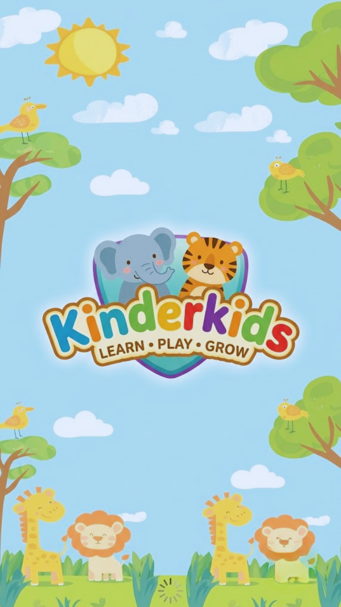
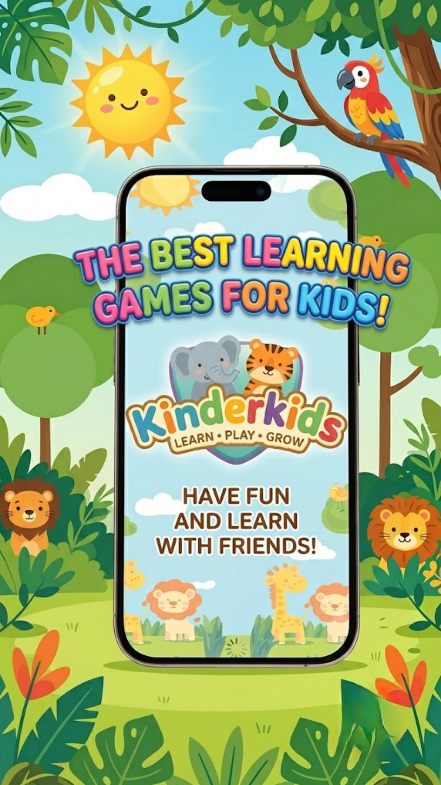
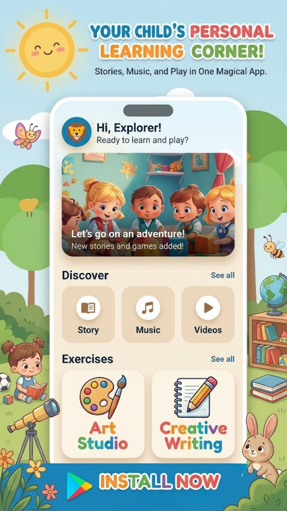
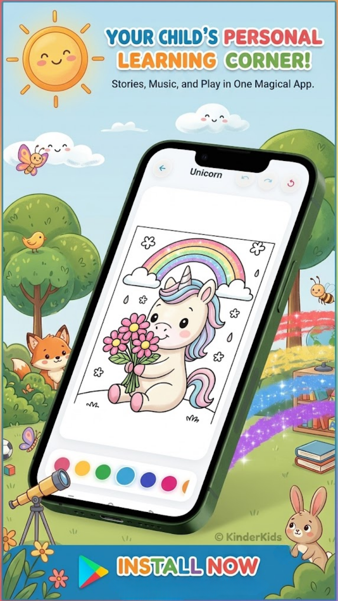
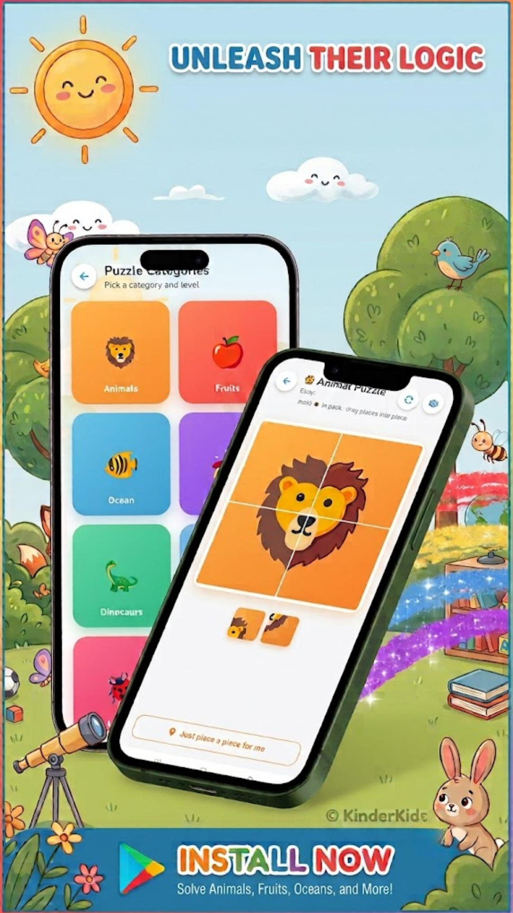

# 🌈🧸 KinderKids — Learn, Play & Grow!

**KinderKids** is a magical world where kids learn while having FUN! 🎉  
Through colors, sounds, and interactive games, children discover **letters, numbers, and more** in a joyful and safe environment.

---

## ✨ About KinderKids

**KinderKids** is an **Android educational app** made especially for little learners 👶📚

It turns learning into a playful adventure full of:

🎨 Bright colors  
🔊 Fun sounds  
🎮 Mini games  
😊 Friendly characters

The app helps children:

- 🌟 Learn independently
- 🧠 Improve memory & recognition
- 🎧 Develop listening skills
- 🎯 Stay focused while having fun

Everything is designed to be **simple, safe, and 100% kid-friendly** 💖

---

## 🚀 Fun Features

### 🔤 ABC Adventure

- Learn **letters (A–Z / أ–ي / FR)**
- 🔊 Clear pronunciation sounds

---

### 🔢 Numbers Playground

- Learn numbers step by step 🔟
- Count with fun objects 🍭🍎⚽

---

### 🎮 Mini Learning Games

- 🎯 Simple quizzes puzzle

---


### 🎨 Kid-Friendly Design

- 🟡 Big buttons & icons
- 🌈 Soft & colorful UI
- 👆 Easy navigation 

---

## 🛠 Tech & Architecture

KinderKids is built using **modern Android development practices** 💻✨

### 🧠 Architecture

| Layer        | Description                |
|-------------|---------------------------|
| UI 🎨        | Activities / Screens       |
| Logic 🧠     | ViewModel (MVVM)           |
| Data 📦      | Local JSON content         |
| Storage 💾   | Room (progress tracking)   |
| Media 🔊     | Sounds & animations        |

---

### ⚙️ App Qualities

- ✅ Works **offline** 📴
- ✅ Fast & smooth 🚀
- ✅ Clean code structure 🧼
- ✅ Works on phones & tablets 📱
- ✅ Safe for kids (No ads 🚫)

---

## 📸 Screenshots

### 🏠 Home & Learning Sections

|  |  |
|-------|-----------|
|  |  |

---

### 🎮 Fun Activities

| |  |
|--------------|-------------|
|  |  |

---

### 🌟 More Fun

| Extra Screen |
|-------------|
|  |

---

## 🛠 Installation

### 1️⃣ Clone the project

```bash
git clone https://github.com/wieam-ar/KinderKids.git